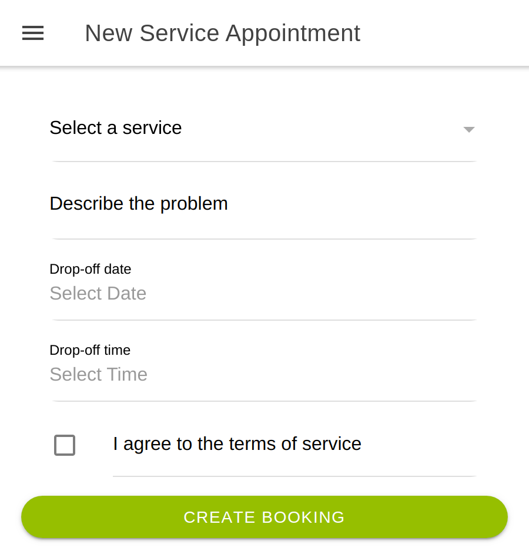
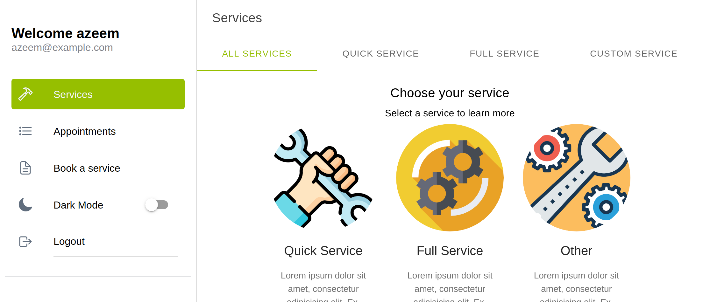

# Vehicle Service Booking

<!-- PROJECT LOGO -->

<br />
<p align="center">
  <a href="https://github.com/Azeem838/vehicle-service-booking.git">
    </p>
    <p align="center"> 
  </a>

  <h3 align="center">Vehicle Service Booking - React/Ionic in the front-end and a Rails-API in the back-end </h3>

  <p align="center">
    <a href="https://github.com/Azeem838/vehicle-service-booking/issues">Report a Bug or Request a Feature</a>
    ·
    <a href="http://azeemahmed.me/vehicle-service-booking/">Live Demo</a>
  </p>
</p>

<!-- Live Link  -->

### [Live Demo Link](http://azeemahmed.me/vehicle-service-booking/)

<br>
<!-- ABOUT THE PROJECT -->

## About The Project

This is the Ruby on Rails back-end API for the Vehicle Service Booking app which can be viewed [here](https://github.com/Azeem838/vehicle-service-booking/).

This project follows the business requirements layout on [here](https://www.notion.so/Final-Capstone-Project-Book-an-Appointment-41ded2ee99ff4fe4becf91acb332ca26).

This repo contains the Rails back-end which functions as an API only. It handles authentication via JWT, tracks a users bookings and stores information essential to the app.

<!-- CONTROL'S -->

## Built With

- Rails
- RSpec
- JWT

## How to use

Users can:

- register and login to the account
- view list of services items and learn more about each service
- book a service on the service details page or by using the link in the side menu
- view their booking by navigating to the Appointment tab in the menu
- toggle dark mode in the menu

## API

Local Base URL is the url of the rails server, usually <http://localhost:3000>
The deployed base Url: <https://vehicle-service-booking-api.herokuapp.com>

You can run all the commands in postman, the base url needs to be altered for the requests when needed:
[](https://app.getpostman.com/run-collection/7f52c6333dcad728b254)

### [Link to full API docs](./doc/API.md)

## ERD for Rails database

<p align="center">
  <a href="./doc/vehicle-service-booking-ERD.png"> 
  </a>
</p>

### Installation

To run the app locally, clone the repository and navigate to it's directory:

```bash
https://github.com/Azeem838/vehicle-service-booking.git
cd laptech
git checkout api-feature
bundle install
rails db:create
rails db:migrate
rails db:seed
rails s
```

Now go to [localhost:3000](http://localhost:3000) in your browser.

### Automated Testing 🧪

The app was test with rspec and factoryBot and shoulda-matchers.

```bash
rspec
```

## "Nice To Have Requirements" that are implemented

- Implemented proper user authentication from the front-end to the server
- Created a user table in the database, so that a given user can only access the favourites they selected
- Made the app responsive, created both tablet and desktop versions, following design guidelines
- Transitions were implemented to make the user experience better
- Created full documentation for the API
- Dark Mode via toggle

## Potential Updates

- More services and details
- Uses will be able to chat with their mechanic
- Payment functionality
- Email notification to remind the the users on their next service
- An admin panel to add services, specials

<!-- CONTACT -->

## Developer

:bust_in_silhouette: **Azeem Ahmed**

- Github: [@Azeem838](https://github.com/Azeem838)
- LinkedIn: [Azeem Ahmed](www.linkedin.com/in/azeemmahmed)

## Show your support

Give a ⭐️ if you like this project!

## Acknowledgments

Design influenced by [Murat Korkmaz on Behance](https://www.behance.net/muratk)

<!-- MARKDOWN LINKS & IMAGES -->
<!-- https://www.markdownguide.org/basic-syntax/#reference-style-links -->

## 📝 License

This project is [MIT](https://opensource.org/licenses/MIT) licensed.
